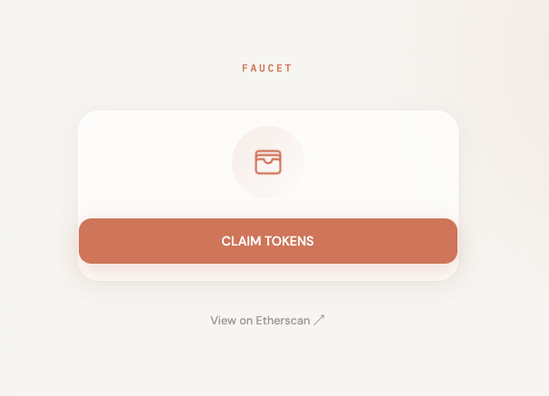

# FAUCET

A complete ERC-20 token and faucet ecosystem running on the Ethereum Sepolia test network. 
Deploy, distribute, and interact with your token directly from a simple browser application!

## Getting Started

### Prerequisites

* Install modules
  ```sh
  brew install nvm
  ```
### Installation

1. Clone the repo
   ```sh
   git clone https://github.com/toov00/FAUCET.git
   ```
2. Install NPM packages
   ```sh
   npm install
   ```
3. Enter your wallet's private key in `.env`
   ```js
   const PRIVATE_KEY = 'ENTER PRIVATE KEY';
   ```
4. Enter your RPC url in `.env`
   ```js
   const RPC_URL = 'ENTER RPC URL';
   ```

## Usage

1. Deploy the faucet
   ```sh
   npx hardhat run scripts/deploy.js --network sepolia
   ```

2. Enter your token address in `frontend/index.html`
   ```js
   const TOKEN_ADDRESS = 'ENTER TOKEN ADDRESS';
   ```

3. Enter your faucet address in `frontend/index.html`
   ```js
   const FAUCET_ADDRESS = 'ENTER FAUCET ADDRESS';
   ```

4. Run the frontend
   ```sh
   npx serve frontend
   ```

5. Go to localhost:3000, and click the button to claim your free tokens!
   
   
## Roadmap

- [x] Add Usage details
- [ ] Reframe as Chrome Extension

